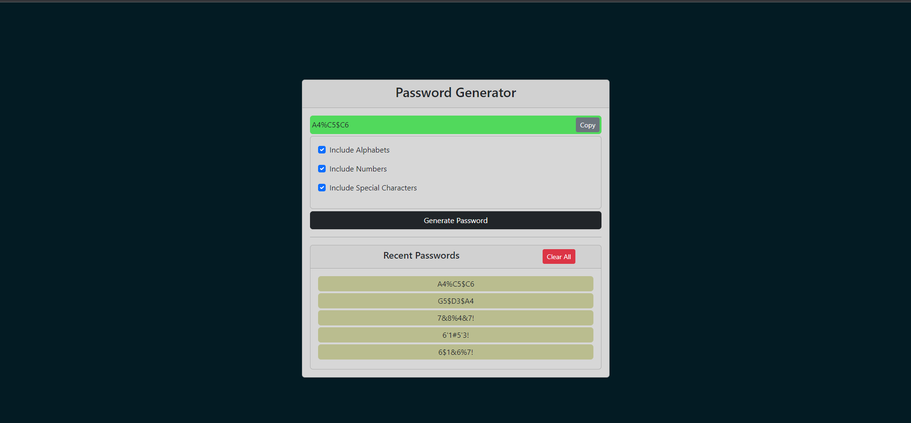

# Live URL
   [https://react-password-generator-m7m7pipiu-vigneshajay98.vercel.app](https://react-password-generator-m7m7pipiu-vigneshajay98.vercel.app/)

# Localhost installation
   - npm install
   - npm start

# Working Procedure
   - 3 options available for selecting password pattern.
   - Atleast one option must be selected to generate password.
   - Generated password will be in 8 characters length.
   - Password can be copied to clipboard by clicking the copy button.
   - All previously entered passwords is stored in local storage.
   - Last 5 passwords is listed in the Recent Passwords sections.
   - Clear All button deletes all the passwords stored in local storage.

# Screenshot
